<div align="center">


# Peddy — Pet Adoption Platform

**Browse, like, and adopt your next best friend.**

A responsive pet adoption website built with HTML, Tailwind CSS, and vanilla JavaScript, powered by the Programming Hero Peddy API.

[**🔗 Live Site**](https://your-live-link-here) · [**📂 Repository**](https://github.com/mahmudscode/Peddy_web)


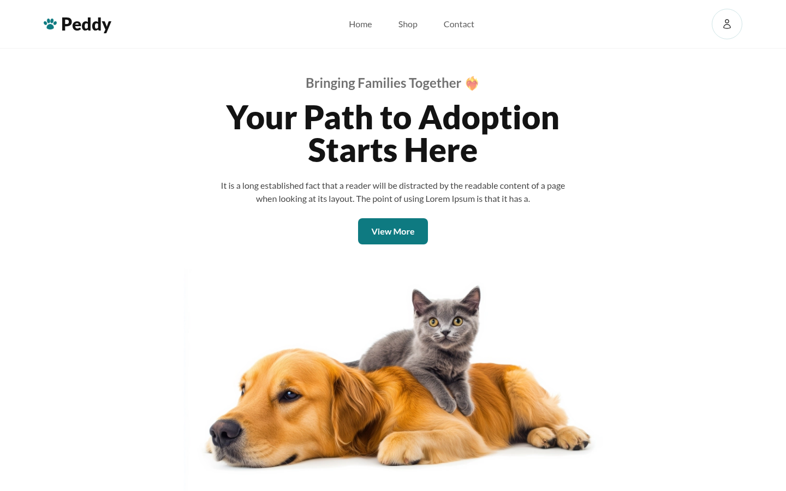

</div>

---

## 📖 About

Peddy is a single-page pet adoption platform. Visitors can browse every available pet or filter by category, sort by price, like pets to build a personal shortlist, view full details for any pet, and go through a short adoption flow. All pet data is fetched live from a public REST API, and the layout adapts to desktop, tablet, and mobile screens.

---

## ✨ Key Features

1. **Dynamic categories & filtering** — Cats, Dogs, Rabbits, and Birds are loaded from the API. Clicking one fetches only that category's pets and highlights the active button. Empty categories show a friendly "No Information Available" message.
2. **Sort by price** — Sorts the pets currently on screen (including inside the active category) from highest to lowest price. Pets without a price go last.
3. **Liked pets panel** — Liking a pet adds its photo to a 2‑column grid on the right. After the first like the panel stays in view while you scroll (desktop), and clicking any liked photo opens that pet's details.
4. **Details modal with adoption** — Shows every field the API returns (breed, birth date, gender, price, vaccination status, description) plus an **Adopt** button.
5. **Adoption countdown** — Adopting shows a 3 → 2 → 1 countdown, then the button switches to **Adopted** and is disabled everywhere that pet appears, even after sorting or switching categories.

### Also included

- ⏳ Loading spinner shown for at least 2 seconds on every pet fetch
- 🧩 Graceful handling of `null` / missing API values (`Not available` placeholders and a fallback image)
- 📌 Fixed navbar with smooth-scroll links (Home → banner, Shop → pets, Contact → footer) and a collapsible mobile menu
- 🛡️ Race-condition guard so fast category clicks never show stale results

---

## 📸 Screenshots

### Adopt Your Best Friend — liked pets on the right

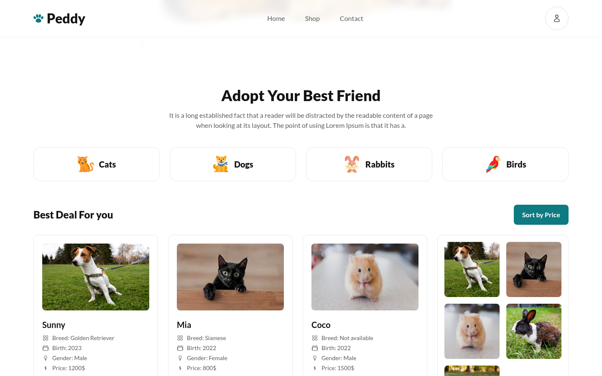

### Active category, sorted by price

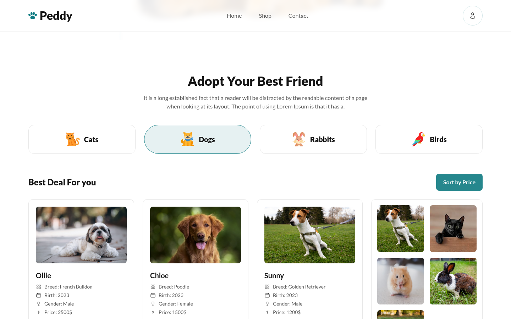

### Pet details modal

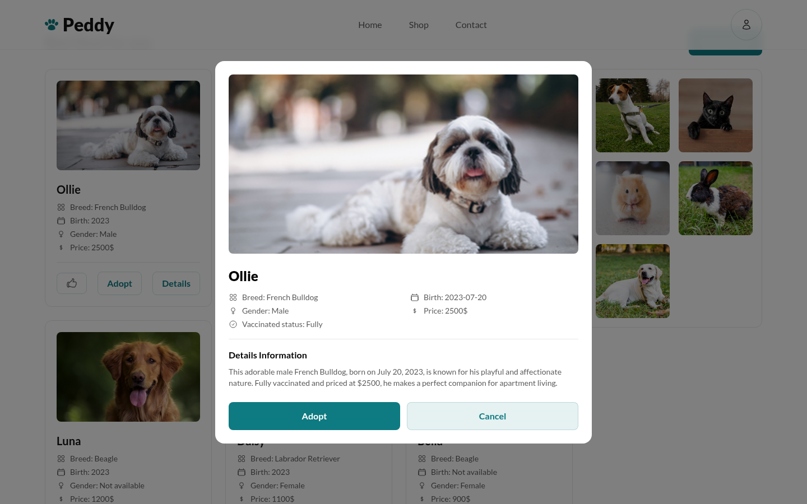

### Adoption countdown

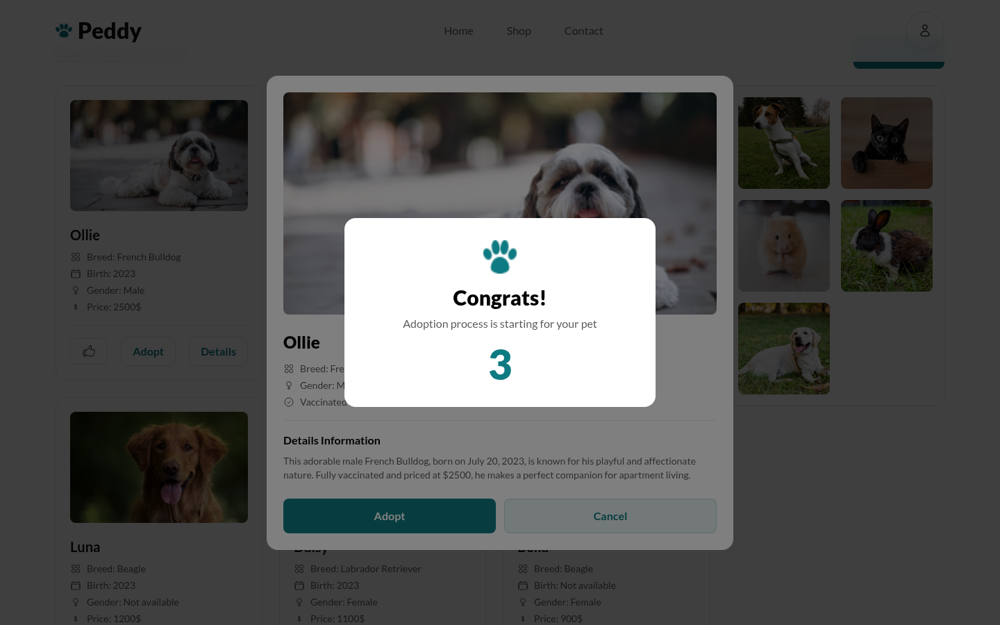

### Empty category

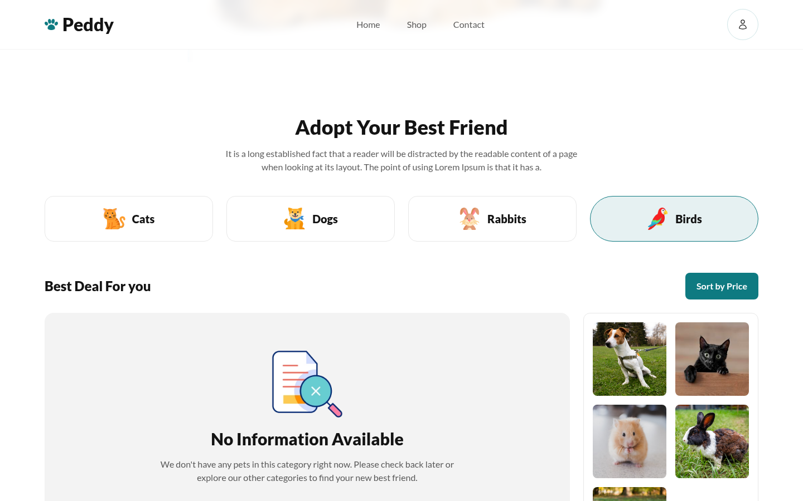

### Footer

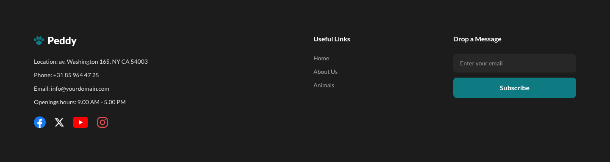

### Mobile

| Home | Menu | Pets |
|:---:|:---:|:---:|
| 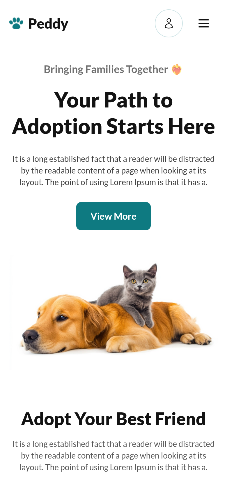 | 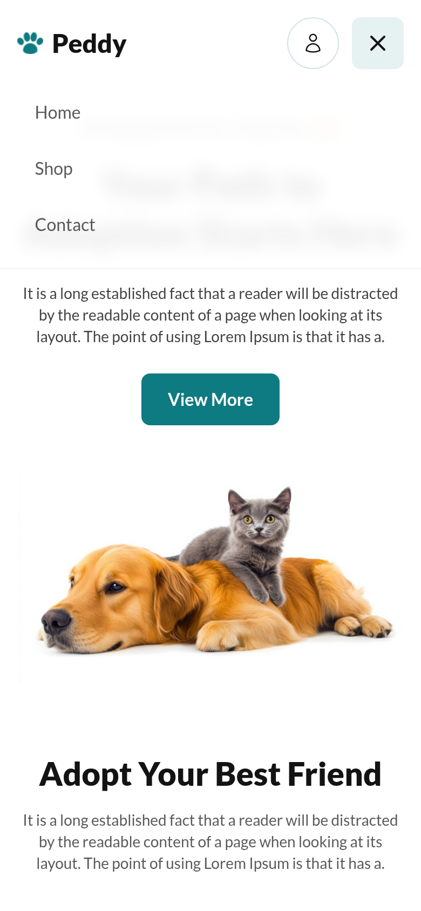 | 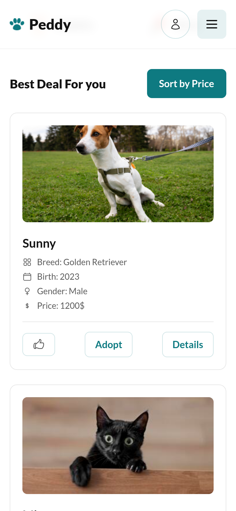 |

<details>
<summary><b>Full page (desktop)</b></summary>

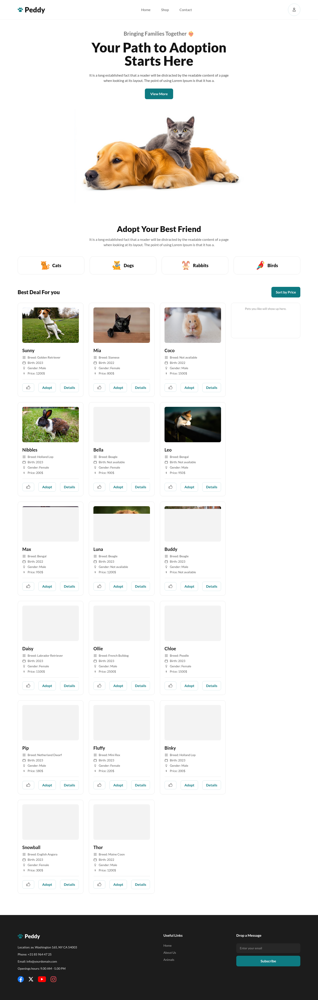

</details>

---

## 🔌 API Reference

Base URL: `https://openapi.programming-hero.com/api/peddy`

| # | Purpose | Method & Endpoint | Response key |
|---|---|---|---|
| 1 | All pets | `GET /pets` | `pets` |
| 2 | Pet details by ID | `GET /pet/{petId}` | `petData` |
| 3 | All categories | `GET /categories` | `categories` |
| 4 | Pets by category | `GET /category/{categoryName}` | `data` |

### 1. Fetch all pets

```http
GET https://openapi.programming-hero.com/api/peddy/pets
```

Returns every pet available for adoption. Used on first page load.

### 2. Fetch pet details by ID

```http
GET https://openapi.programming-hero.com/api/peddy/pet/1
```

Returns one pet with its full description. Used by the **Details** button and liked-pet thumbnails.

```json
{
  "status": true,
  "message": "successfully fetched pet data using id 1",
  "petData": {
    "petId": 1,
    "breed": "Golden Retriever",
    "category": "Dog",
    "date_of_birth": "2023-01-15",
    "price": 1200,
    "image": "https://i.ibb.co.com/p0w744T/pet-1.jpg",
    "gender": "Male",
    "pet_details": "This friendly male Golden Retriever is energetic and loyal...",
    "vaccinated_status": "Fully",
    "pet_name": "Sunny"
  }
}
```

### 3. Fetch all categories

```http
GET https://openapi.programming-hero.com/api/peddy/categories
```

```json
{
  "status": true,
  "categories": [
    { "id": 1, "category": "Cat", "category_icon": "https://i.ibb.co.com/N7dM2K1/cat.png" },
    { "id": 2, "category": "Dog", "category_icon": "https://i.ibb.co.com/c8Yp1y7/dog.png" },
    { "id": 3, "category": "Rabbit", "category_icon": "https://i.ibb.co.com/3hftmLC/rabbit.png" },
    { "id": 4, "category": "Bird", "category_icon": "https://i.ibb.co.com/6HHZwfq/bird.png" }
  ]
}
```

### 4. Fetch pets by category

```http
GET https://openapi.programming-hero.com/api/peddy/category/dog
```

The category name is sent in **lowercase** (`cat`, `dog`, `rabbit`, `bird`). A category with no pets returns `"data": []`, which the site shows as an empty-state message.

> **Heads-up:** some pets have missing fields in the API (e.g. Coco has no `breed`, Bella and Leo have no `date_of_birth`, Luna has no `gender`, Buddy has no `price`, Max has no `vaccinated_status`). Peddy displays `Not available` for these instead of leaving them blank.

---

## 🧠 ES6+ Features Used

| Feature | Where it's used |
|---|---|
| `const` / `let` | All variables — no `var` |
| Arrow functions | Every handler and helper, e.g. `const delay = (ms) => new Promise(...)` |
| Template literals | Building pet cards, modals, and API URLs (`` `${API}/pet/${id}` ``) |
| Object destructuring | `const { categories } = await res.json()`, card fields in `.map(({ pet_name, breed, ... }) => ...)` |
| Array destructuring | `const [res] = await Promise.all([fetch(url), delay(2000)])` |
| Default parameters | `const fallback = (value, text = 'Not available') => ...` |
| Spread operator | `[...currentPets].sort(...)` to sort without mutating the original |
| `async` / `await` | All API calls |
| Promises & `Promise.all` | Keeps the spinner visible for at least 2 seconds |
| `Set` | Tracks adopted pet IDs across re-renders |
| Nullish coalescing `??` | `data[key] ?? []`, `b.price ?? 0` while sorting |
| Array methods | `map`, `join`, `sort`, `forEach` |

---

## 🗂️ Project Structure

```
Peddy_web/
├── index.html        # Page markup (navbar, banner, pets section, footer, modals)
├── js/
│   └── main.js       # API calls, rendering, like / adopt / sort / details logic
├── images/           # Logo, banner image, empty-state illustration
├── screenshots/      # README screenshots
└── Readme.md
```

---

## 🚀 Run Locally

No build step is needed — Tailwind CSS is loaded from its CDN.

```bash
git clone https://github.com/mahmudscode/Peddy_web.git
cd Peddy_web
# open index.html directly, or serve it:
python3 -m http.server 8000
# then visit http://localhost:8000
```

---

## 🛠️ Built With

- **HTML5**
- **Tailwind CSS** (Play CDN) — custom `primary` (`#0E7A81`) and `dark` (`#131313`) colors
- **Vanilla JavaScript (ES6+)**
- **Google Fonts** — Lato
- **Programming Hero Peddy API**

<div align="center">

Made with 🐾 for pets looking for a home.

</div>
